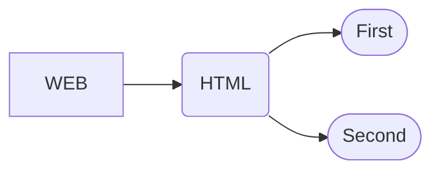

# FU Домашнее задание.

#### Помощь в ориентировке в репозитории.

### **WEB**

### WEB.HTML

* [ ] **[First](/scr/WEB/HTML/First) - Первое домашнее задание** - номер файла = номер задания; задание 33 - Задача 1.
* [ ] **[Second](/scr/WEB/HTML/Second) - Второе домашнее задание** - номер файла = номер задания;

## Карта репозитория

