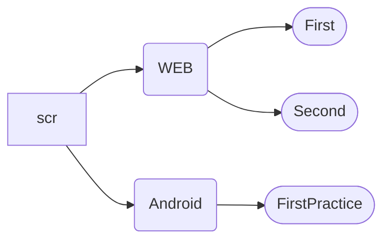

# FU Домашнее задание.

#### Помощь в ориентировке в репозитории.

### Practical

* [X] **[FileManager](/scr/Practical/FileManager) - Вторая Лабораторная работа** - Файловый менеджер. Комментарии в коде
* [X] **[Server](/scr/Practical/Server) - Третья и Четвёртая Лабораторные работы** - Эхо-сервер с 3 по 10 задания/Мультипоточный сервер 2-4 задания

### WEB

* [X] **[First](/scr/WEB/HTML/First) - Первое домашнее задание 1-2** - номер файла = номер задания; задание 33 - Задача 1 -> http://empire-org.fun:8080/fu-data
* [X] **[Second](/scr/WEB/HTML/Second) - Второе домашнее задание 3-4**
* [X] **[Third](/scr/WEB/HTML/Third) - Третье домашнее задание 5-6** 
* [] **[Four](/scr/WEB/HTML/Four) - Четвёртое домашнее задание 7-8**
* [X] **[Five](/scr/WEB/HTML/Four) - Пятое домашнее задание 9-10**

### Android

* [X] **[First](/scr/Android/FirstPractice/app) - Первая Практическая Работа** - в папке app всё приложение; в папке apk, APK файл приложения

## Карта репозитория

Это должно быть здесь вследствие того что ~~Microsoft сделали из GitHub кусок говна~~ GitHub не поддерживает адоптивные диаграммы.
