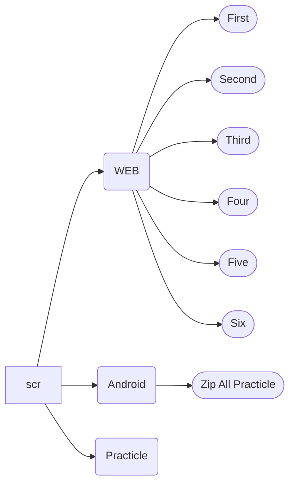

# FU Домашнее задание.

#### Помощь в ориентировке в репозитории.

### Practical

* [X] **[FileManager](/scr/Practical/FileManager) - Вторая Лабораторная работа** - Файловый менеджер. Комментарии в коде
* [X] **[Server](/scr/Practical/Server) - Третья и Четвёртая Лабораторные работы** - Эхо-сервер с 3 по 10 задания/Мультипоточный сервер 2-4 задания

### WEB

* [X] **[First](/scr/WEB/First) - Первое домашнее задание 1-2**
* [X] **[Second](/scr/WEB/Second) - Второе домашнее задание 3-4**
* [X] **[Third](/scr/WEB/Third) - Третье домашнее задание 5-6** 
* [X] **[Four](/scr/WEB/Four) - Четвёртое домашнее задание 7-8**
* [X] **[Five](/scr/WEB/Five) - Пятое домашнее задание 9-10**
* [X] **[Six](/scr/WEB/Six) - Шестое-седьмое домашнее задание 11-12**
* [X] **[KR](/scr/WEB/KR) - Контрольная работа**

### Android

* [X] **[Android](/scr/Android) - Архивы Практических Работ**

## Карта репозитория

Просто не трогай то что ниже

